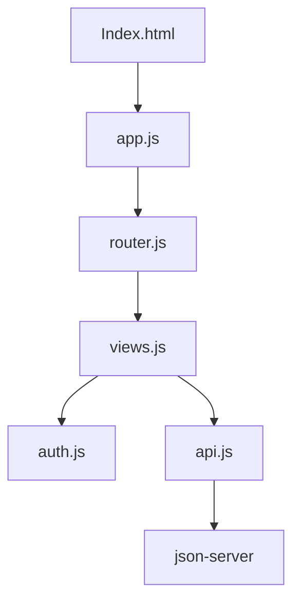

# SPA Cursos: Plataforma de Gestión de Cursos


Una Single Page Application (SPA) moderna para la gestión de cursos educativos, con autenticación de usuarios, roles diferenciados y operaciones CRUD completas.

## Tabla de Contenidos

1. [Características Principales](#características-principales)
2. [Demo](#demo)
3. [Tecnologías](#tecnologías)
4. [Instalación](#instalación)
5. [Configuración](#configuración)
6. [Uso](#uso)
7. [Estructura del Proyecto](#estructura-del-proyecto)
8. [Arquitectura](#arquitectura)
9. [API Endpoints](#api-endpoints)
10. [Licencia](#licencia)

---

## Características Principales

✔️ **Autenticación Segura**  
- Registro e inicio de sesión con roles (Admin/Estudiante)
- Hash de contraseñas con SHA-256
- Persistencia de sesión con localStorage

👨‍💻 **Funcionalidades para Administradores**  
- CRUD completo de cursos
- Gestión de capacidad e inscripciones
- Panel de control intuitivo

🎓 **Funcionalidades para Estudiantes**  
- Exploración de cursos disponibles
- Inscripción en cursos con validación
- Visualización de cursos inscritos

🚀 **Otros Features**  
- Enrutamiento dinámico sin recargas
- Diseño responsivo (mobile-first)
- Validaciones de formularios
- Mensajes de feedback al usuario
- Protección de rutas por roles

## Tecnologías

**Frontend:**
- HTML5 semántico
- CSS3 moderno (Flexbox, Grid)
- JavaScript ES6+
- Web Crypto API (SHA-256)

**Backend Simulado:**
- json-server (API REST mock)
- db.json (Base de datos local)

**Herramientas:**
- npm (Gestión de dependencias)
- Git (Control de versiones)

## Instalación

Sigue estos pasos para configurar el proyecto localmente:

1. **Clonar el repositorio**
   ```bash
   git clone https://github.com/clevervi/SPA-Cursos
   cd spa-cursos
   ```

2. **Instalar dependencias**
   ```bash
   npm install
   ```

## Configuración

1. **Iniciar el servidor API** (en una terminal aparte)
   ```bash
   npm run start:api
   ```
   El servidor se ejecutará en `http://localhost:3000`

2. **Iniciar la aplicación** (en otra terminal)
   ```bash
   npm start
   ```
   La aplicación estará disponible en `http://127.0.0.1:8080`

## Uso

### Credenciales de Prueba

**Administrador:**
- Email: `admin@example.com`
- Contraseña: `admin123`

**Estudiante:**
- Email: `student@example.com`
- Contraseña: `student123`

### Flujo Principal

1. **Autenticación**
   - Accede a `/login` para iniciar sesión
   - O a `/register` para crear una cuenta

2. **Dashboard**
   - Vista principal después del login
   - Muestra opciones según tu rol

3. **Gestión de Cursos**
   - Admins: Pueden crear/editar/eliminar cursos
   - Estudiantes: Pueden inscribirse en cursos disponibles

4. **Cerrar Sesión**
   - Disponible en el menú principal

## Estructura del Proyecto

```
spa-cursos/
├── public/
│   ├── index.html         # Punto de entrada
│   ├── styles.css         # Estilos globales
│   └── js/
│       ├── app.js         # Inicialización
│       ├── router.js      # Manejo de rutas
│       ├── views.js       # Vistas UI
│       ├── auth.js        # Lógica de autenticación
│       └── api.js         # Comunicación con API
├── db.json                # Base de datos mock
├── package.json
└── README.md
```

## Arquitectura



1. **app.js**: Inicializa el enrutador y maneja eventos globales
2. **router.js**: Controla la navegación y protección de rutas
3. **views.js**: Renderiza todas las interfaces de usuario
4. **auth.js**: Maneja autenticación y autorización
5. **api.js**: Realiza peticiones HTTP al backend mock

## API Endpoints

La aplicación consume estos endpoints del servidor mock:

**Usuarios:**
- `GET /users` - Listar usuarios
- `POST /users` - Crear usuario
- `GET /users?email={email}` - Buscar usuario por email

**Cursos:**
- `GET /courses` - Listar todos los cursos
- `POST /courses` - Crear nuevo curso
- `PUT /courses/{id}` - Actualizar curso
- `DELETE /courses/{id}` - Eliminar curso
